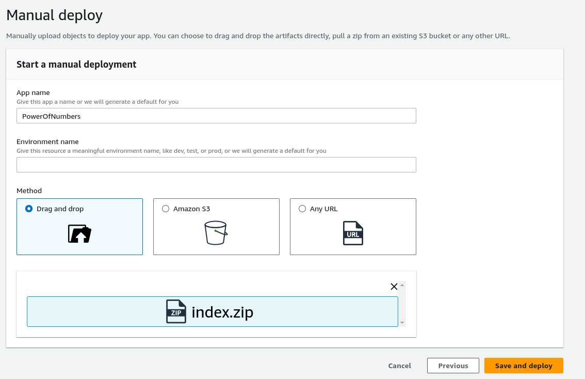
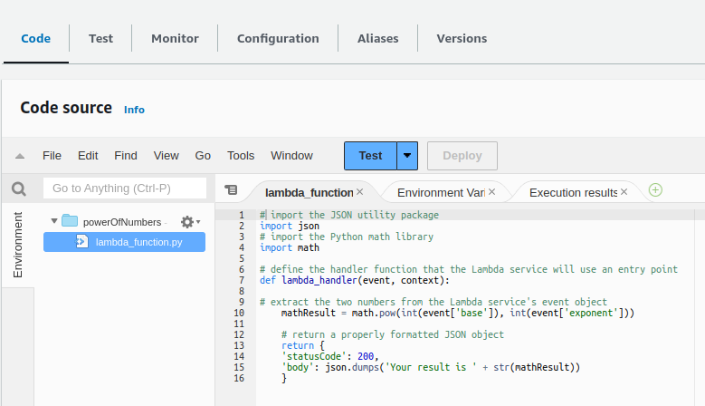
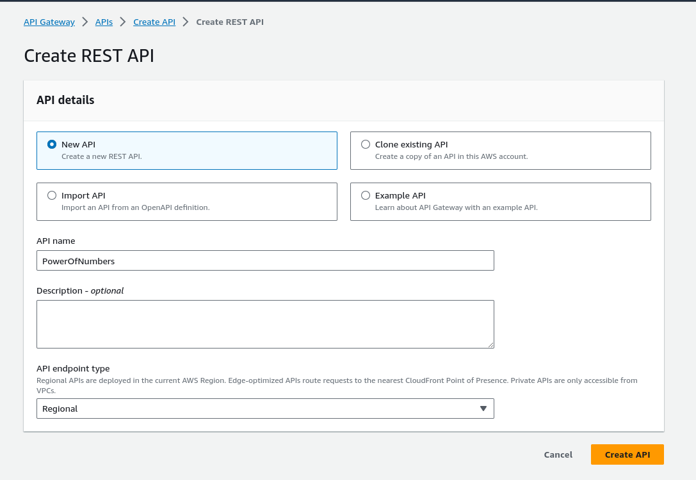
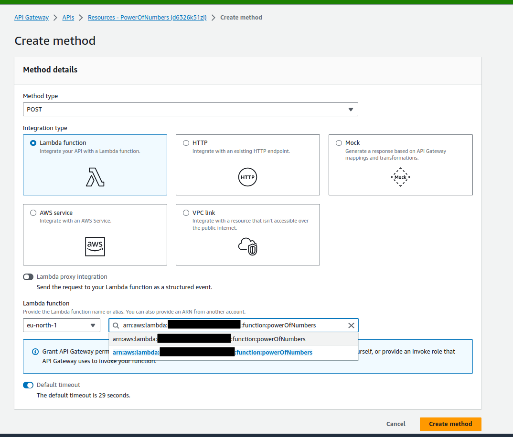
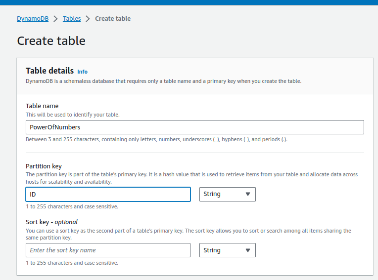
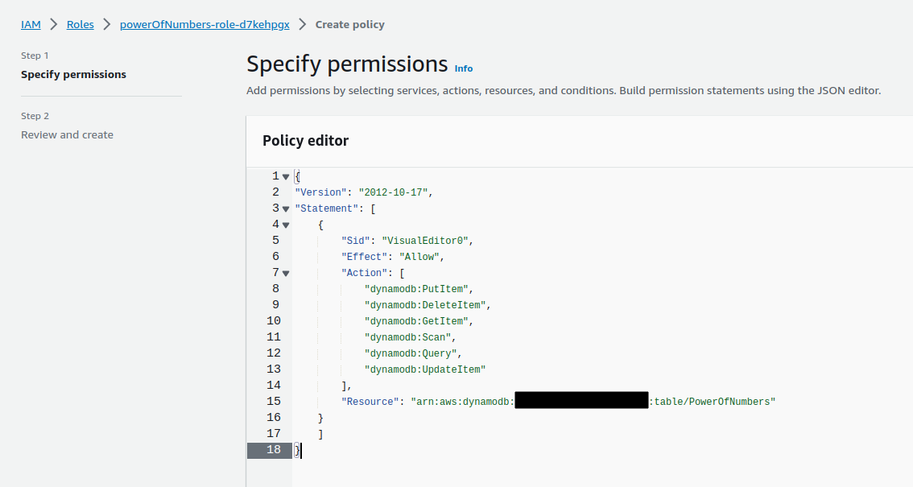
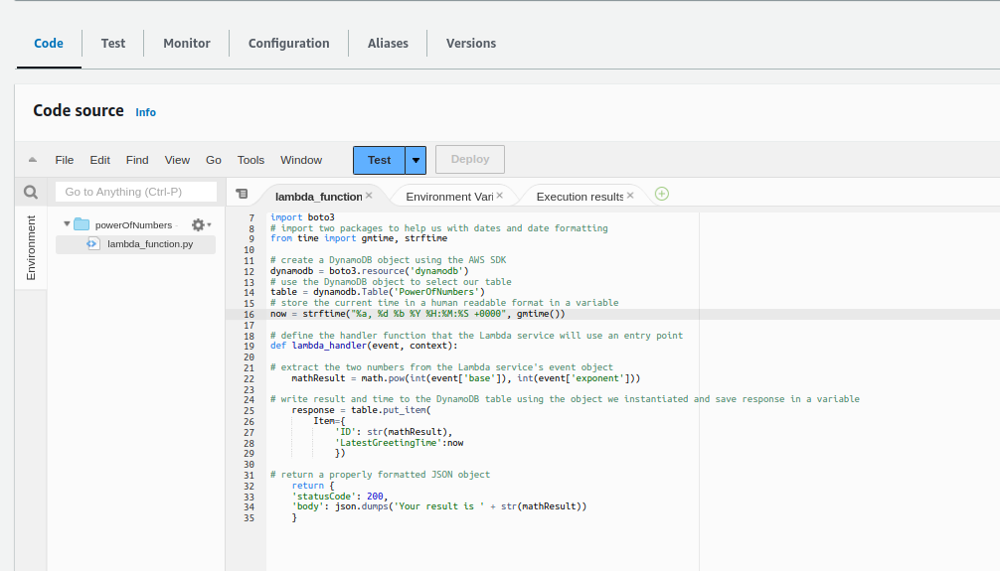
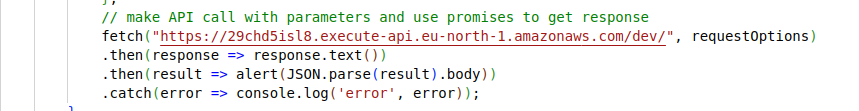
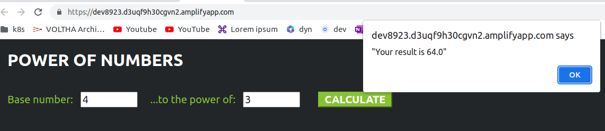

# WIP

### Simple Web App

A simple web application that takes the base and exponent numbers and finds the result using the following AWS services.

- **AWS Amplify**: Build full-stack web and mobile apps 

- **Amazon API Gateway**: It is a fully managed service that makes it easy for developers to create, publish, maintain, monitor, and secure APIs.

- **AWS Lambda**: It is a cloud service that lets you run code without provisioning or managing servers (serverless).

- **Amazon DynamoDB**: Serverless, NoSQL database.

- **AWS IAM**:  Manage identities and access to AWS services and resources

### How to

1. Create a web page (check the index.html)

2. Create a zip file of the index.html

3. Deploy the zip file (index.zip) using AWS amplify

4. Create a Lambda function called powerOfNumbers

    - paste the python code (powerOfNumbers.py) to the code part like below

      -  

    - Press the "Deploy" to deploy the code.S

5. Create a Rest API using Amazon API Gateway

  -  

  - Create a method and call the lambda function

    - 

  - Select resource and enable CORS -> https://docs.aws.amazon.com/apigateway/latest/developerguide/how-to-cors-console.html

  - Finally Deploy the API.
   
6. Save the result into the DynamoDB 

  - Create a Table

    - 

    - Give permission to Lambda function to be able to write/delete/read/update data to DynamoDB:

       - 

    - Update the python code in the Lambda (using powerOfNumbersWithSaveItDB.py) like below:

      -  

7. Update index.html to reach the API Gateway

  - Replace "YOUR API GATEWAY ENDPOINT" value in the index.html with your API Gateway's endpoint.

    - 

    - Create a zip file of the index.html again.

    - Deploy the zip file (index.zip) using AWS amplify again.

    - Test it again
      
       -  

8. After completing your work/test, delete all the AWS resources that you have created:

  - Delete the app from AWS Amplify

  - Delete the table from DynamoDB

  - Delete the function from Lambda

  - Delete the API from API Gateway

  - Delete the roles from IAM

### Resources

1. [AWS Project - Architect and Build an End-to-End AWS Web Application from Scratch, Step by Step - Tiny Technical Tutorials](https://www.youtube.com/watch?v=7m_q1ldzw0U)

2. https://aws.amazon.com/pm/lambda/

3. https://aws.amazon.com/amplify/

4. https://aws.amazon.com/api-gateway/

5. https://aws.amazon.com/dynamodb/

6. https://aws.amazon.com/iam/